# UNO Demo — Architecture Diagram and Notes

Below is a high-level architecture diagram for the UNO demo and short explanations for each component. The diagram is written in Mermaid; the exported SVG image below is embedded so it can be viewed directly in the markdown preview.

## Component responsibilities

- Frontend (web/src):
  - `Router`: navigation between Home / Play / Won pages.
  - `Pages`: orchestrate page-level logic and compose UI components.
  - `Components`: visual card components, modals, input controls and small presentational widgets.
  - `API` and `WS`: provide REST and real-time communication interfaces.

- Server (`server/`):
  - `app.py`: HTTP endpoints and Socket.IO handlers.
  - `server/lib/state.py`: centralized in-memory state manager for rooms, players and active games.
  - `server/core/uno.py`: deterministic game rules and `Game` class; keep logic pure and testable.
  - `server/lib/*`: helpers for notifications, parsing, and event name constants.

- Infra:
  - Redis is optional for dev; used to persist or coordinate state if you extend the demo.

## Suggested assignment / exercise points

- Implement input validation for `GAME_PLAY` to return clear errors and add regression tests.
- Add persistence for room metadata in Redis and write tests for failure scenarios.
- Improve client-side optimistic updates when a player plays a card.
- Add end-to-end tests that spin up the server and simulate multiple socket clients.

## How to render

- In VS Code install a Markdown previewer that supports Mermaid, or open this file on GitHub which renders Mermaid diagrams automatically.

## Notes for instructors

- Keep the `Game` logic small and pure so students can write unit tests easily.
- Use the flows in the diagram to create small, reviewable PR tasks: e.g., `feat: validate-play-action` or `test: add-gamecore-play-regression`.

